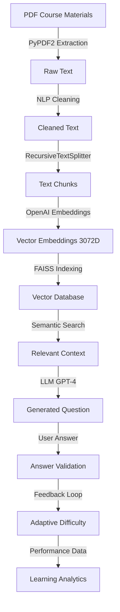

# Adaptive & Cognitive Smart Learning Platform - Quiz Application

<div align="center">


**An AI-powered adaptive learning system utilizing Large Language Models and Vector Databases for intelligent question generation and personalized learning experiences.**

</div>

---

## 🎓 Research Project Overview

**Project Type:** Ongoing Group Research Project  
**Research Focus:** Adaptive Learning Systems & Cognitive Intelligence in Education  
**My Role:** Lead Developer - AI/ML Backend & Question Generation Systems  
**Institution:** [Your Institution Name]  
**Last Updated:** February 2026

### Research Objectives

This project represents my contribution to a collaborative research effort exploring:

1. **Adaptive Learning Paradigms**: Dynamic difficulty adjustment based on learner performance using machine learning techniques
2. **Large Language Model Applications in Education**: Leveraging GPT-4 for intelligent question generation and answer validation
3. **Semantic Information Retrieval**: Using vector embeddings and FAISS for context-aware content extraction
4. **Cognitive Learning Analytics**: Tracking learner patterns and providing personalized feedback

### Research Domains

Currently supporting three specialized technical domains:
- **Cloud Computing** - Cloud architecture, services, and deployment strategies
- **Deep Learning** - Neural networks, AI/ML algorithms, and model training
- **Database Administration** - Database design, optimization, and management

---

## 🤖 Machine Learning & AI Architecture

### Core ML/AI Technologies

#### 1. **Large Language Models (LLMs)**
- **Model:** OpenAI GPT-4 (gpt-4-turbo)
- **Primary Functions:**
  - **Question Generation**: Automatically generates contextually relevant multiple-choice, fill-in-the-blank, and open-ended questions
  - **Answer Validation**: AI-powered validation of open-ended responses with detailed feedback
  - **Difficulty Adaptation**: Adjusts question complexity based on learner performance
  - **Explanation Generation**: Creates detailed explanations for correct/incorrect answers

```python
# Example LLM Agent Architecture
from langchain.chat_models import ChatOpenAI
from langchain.prompts import ChatPromptTemplate

class QuestionGenerationAgent:
    """AI agent for generating adaptive quiz questions using LLM"""
    
    def __init__(self):
        self.llm = ChatOpenAI(
            model="gpt-4-turbo",
            temperature=0.7,  # Balanced creativity
            max_tokens=1000
        )
        
    async def generate_question(self, context: str, difficulty: str):
        """Generate question using retrieved context and difficulty level"""
        # LLM-powered question generation with context awareness
```

#### 2. **Vector Embeddings & Semantic Search**
- **Embedding Model:** OpenAI text-embedding-3-large (3072 dimensions)
- **Vector Database:** FAISS (Facebook AI Similarity Search)
- **Purpose:** Convert educational content into semantic vectors for intelligent retrieval

**Technical Implementation:**
```python
# Vector Embedding Pipeline
embeddings = OpenAIEmbeddings(
    model="text-embedding-3-large",
    dimensions=3072
)

# Create vector store with L2 distance metric
vector_store = FAISS.from_documents(
    documents=text_chunks,
    embedding=embeddings,
    distance_strategy=DistanceStrategy.EUCLIDEAN
)
```

**Key Features:**
- **Semantic Similarity**: Retrieves content based on meaning, not just keywords
- **Contextual Relevance**: Finds most relevant course material for question generation
- **Diversity Filtering**: Ensures varied content (cosine similarity threshold: 0.2)
- **Scalable Retrieval**: Efficient similarity search across thousands of documents

#### 3. **LangChain Framework**
- **Version:** 0.3.x
- **Role:** Orchestrates AI workflows and agent coordination

**Agent Types Implemented:**
- **Question Generation Agents**: Create different question types (MCQ, fill-in-blank, open-ended)
- **Validation Agents**: Verify question quality and answer correctness
- **Adaptive Selection Agents**: Choose appropriate difficulty based on performance
- **User Tracking Agents**: Monitor learning progress and patterns

#### 4. **Natural Language Processing Pipeline**

```python
# Document Processing Pipeline
from langchain.text_splitter import RecursiveCharacterTextSplitter

# NLP-based text chunking with overlap for context preservation
text_splitter = RecursiveCharacterTextSplitter(
    chunk_size=1000,          # Optimal chunk size for embeddings
    chunk_overlap=200,        # Maintains context between chunks
    length_function=len,
    separators=["\n\n", "\n", " ", ""]
)
```

### Machine Learning Workflow



---

## 🐍 Python Technology Stack

### Backend - FastAPI (quiz-app-backend/)

**Core Python Technologies:**

#### AI/ML Libraries
```python
# requirements.txt
langchain==0.3.x              # LLM orchestration framework
langchain-openai==0.2.x       # OpenAI integrations
langchain-community==0.3.x    # Community tools
openai==1.50.x                # OpenAI API client
faiss-cpu==1.7.4              # Vector similarity search
```

#### Data Processing
```python
PyPDF2==3.0.x                 # PDF text extraction
langchain-text-splitters      # NLP-based text chunking
numpy>=1.23.5                 # Numerical computations
pandas>=2.0.0                 # Data manipulation (optional)
```

#### Web Framework
```python
fastapi==0.100.x              # High-performance async API
uvicorn==0.22.x               # ASGI server
pydantic==2.0.x               # Data validation
python-multipart==0.0.6       # Form data handling
python-dotenv==1.0.0          # Environment management
```

### Backend - Django (back-end/)

**Programming Question Engine:**
```python
Django==4.x                   # Web framework
djangorestframework           # REST API
psycopg2                      # PostgreSQL driver
celery                        # Async task queue
```

### Python Project Structure

```
quiz-app-backend/
├── app/
│   ├── agents/                           # 🤖 Shared ML Agents
│   │   ├── start_quiz_agent.py          # Session initialization
│   │   ├── validation_agent.py          # Question validation ML
│   │   ├── validate_hard_answer.py      # LLM answer validation
│   │   └── user_tracking_agent.py       # Learning analytics
│   │
│   ├── cloud_computing_component/        # ☁️ Cloud ML Agents
│   │   ├── question_agent.py            # MCQ generation (LLM)
│   │   ├── hard_question_agent.py       # Advanced questions (LLM)
│   │   ├── adaptive_question_agent.py   # Difficulty adaptation (ML)
│   │   └── fill_in_blank_question.py    # Fill-blank generation (LLM)
│   │
│   ├── deep_learning_component/          # 🧠 DL ML Agents
│   │   └── [Same structure as cloud]
│   │
│   ├── database_administration_component/ # 🗄️ DBA ML Agents
│   │   └── [Same structure as cloud]
│   │
│   ├── services/                         # 📊 ML Services
│   │   ├── faiss_service_cloud_computing.py      # Vector search
│   │   ├── faiss_service_deep_learning.py        # Vector search
│   │   └── faiss_service_database_administration.py  # Vector search
│   │
│   └── api/                              # 🌐 REST Endpoints
│       ├── cloud_computing_api.py
│       ├── deep_learning_api.py
│       └── database_administration_api.py
│
├── faiss_db_cloud_computing/             # 💾 Vector Databases
├── faiss_db_deep_learning/
├── faiss_db_database_administration/
│
├── data/                                 # 📚 Training Data
│   ├── Cloud Computing/                  # Raw PDFs
│   ├── Deep Learning/
│   └── Database Administration/
│
└── process_*.py                          # 🔄 ML Data Processing Scripts
```

---

## 🏗️ System Architecture

### Three-Tier Architecture

```
┌─────────────────────────────────────────────────────────────┐
│                    FRONTEND - Next.js 14                    │
│  ┌──────────────┐  ┌──────────────┐  ┌──────────────┐     │
│  │  Dashboard   │  │  Quiz UI     │  │  Analytics   │     │
│  │  TypeScript  │  │  React       │  │  Firebase    │     │
│  └──────────────┘  └──────────────┘  └──────────────┘     │
└───────────────────────────┬─────────────────────────────────┘
                            │ REST API (HTTP)
┌───────────────────────────┴─────────────────────────────────┐
│              BACKEND - FastAPI (Python 3.9+)                │
│  ┌────────────────────────────────────────────────────┐    │
│  │           🤖 LangChain Agents Layer                │    │
│  │  ┌──────────────┐  ┌──────────────┐              │    │
│  │  │ Question Gen │  │ Validation   │              │    │
│  │  │ Agents       │  │ Agents       │              │    │
│  │  └──────┬───────┘  └──────┬───────┘              │    │
│  │         │                  │                       │    │
│  │  ┌──────▼──────────────────▼───────┐              │    │
│  │  │     LLM Integration              │              │    │
│  │  │     (OpenAI GPT-4)               │              │    │
│  │  └──────────────────────────────────┘              │    │
│  └────────────────────────────────────────────────────┘    │
│                            │                                │
│  ┌────────────────────────┴────────────────────────┐       │
│  │      📊 Vector Search Service (FAISS)           │       │
│  │   ┌──────────┐  ┌──────────┐  ┌──────────┐    │       │
│  │   │  Cloud   │  │   DL     │  │   DBA    │    │       │
│  │   │ Vectors  │  │ Vectors  │  │ Vectors  │    │       │
│  │   └──────────┘  └──────────┘  └──────────┘    │       │
│  └──────────────────────────────────────────────────┘       │
└─────────────────────────────────────────────────────────────┘
                            │
┌───────────────────────────┴─────────────────────────────────┐
│           🗄️ DATA LAYER - Vector Databases               │
│  FAISS Indexes (3072D Embeddings) + Firebase Firestore      │
└─────────────────────────────────────────────────────────────┘
```

### Technology Stack Summary

| Layer | Technology | Purpose |
|-------|-----------|---------|
| **Frontend** | Next.js 14, TypeScript, TailwindCSS | User interface & authentication |
| **API Gateway** | FastAPI (Python) | High-performance async endpoints |
| **AI/ML Engine** | LangChain + GPT-4 + OpenAI Embeddings | Question generation & validation |
| **Vector DB** | FAISS (L2 distance) | Semantic similarity search |
| **User Data** | Firebase Firestore | Quiz results & analytics |
| **Auth** | Firebase Authentication | User management |
| **Embeddings** | OpenAI (3072D) | Semantic text representation |

---

## 🚀 Getting Started

### Prerequisites

- **Python:** 3.9 or higher
- **Node.js:** 18.x or higher
- **OpenAI API Key:** Required for LLM operations
- **Firebase Account:** For authentication and data storage

### Installation & Setup

#### 1. Clone Repository
```bash
git clone <repository-url>
cd Quiz_App
```

#### 2. Backend Setup (FastAPI - ML/LLM Engine)

```bash
# Navigate to FastAPI backend
cd quiz-app-backend

# Create virtual environment
python -m venv venv

# Activate virtual environment
# Windows:
venv\Scripts\activate
# macOS/Linux:
source venv/bin/activate

# Install Python dependencies
pip install -r requirements.txt
```

**Configure Environment Variables:**
Create `.env` file in `quiz-app-backend/`:
```env
OPENAI_API_KEY=sk-your-openai-api-key-here
```

**Process Training Data (Create Vector Databases):**
```bash
# Process Cloud Computing PDFs → FAISS vectors
python process_cloud_computing.py

# Process Deep Learning PDFs → FAISS vectors
python process_deep_learning.py

# Process Database Administration PDFs → FAISS vectors
python process_database_administration.py
```

**Start FastAPI Server:**
```powershell
python -m uvicorn app.main:app --reload --port 8001
```

✅ FastAPI running at: http://127.0.0.1:8001  
📚 API Documentation: http://127.0.0.1:8001/docs

#### 3. Backend Setup (Django - Programming Engine)

```bash
cd back-end

# Install dependencies
pip install -r requirements.txt

# Run migrations
python manage.py migrate

# Start Django server
python manage.py runserver
```

✅ Django running at: http://127.0.0.1:8000

#### 4. Frontend Setup (Next.js)

```bash
cd quiz-app-frontend-main

# Install Node dependencies
npm install

# Configure Firebase
# Edit config/firebase.ts with your Firebase credentials
# See FIREBASE_SETUP_GUIDE.md for detailed instructions

# Start development server
npm run dev
```

✅ Frontend running at: http://localhost:3000

---

## 📊 Machine Learning Data Processing Pipeline

### Step 1: Document Extraction

```python
# process_cloud_computing.py example
import PyPDF2
from pathlib import Path

def extract_text_from_pdf(pdf_path: str) -> str:
    """Extract raw text from PDF using PyPDF2"""
    with open(pdf_path, 'rb') as file:
        pdf_reader = PyPDF2.PdfReader(file)
        text = ""
        for page in pdf_reader.pages:
            text += page.extract_text()
    return text
```

### Step 2: Text Cleaning (NLP)

```python
import re

def clean_text(text: str) -> str:
    """Clean and normalize extracted text"""
    # Remove special characters
    text = re.sub(r'[^\w\s\.\,\;\:\!\?\-]', ' ', text)
    # Normalize whitespace
    text = re.sub(r'\s+', ' ', text)
    # Remove extra newlines
    text = re.sub(r'\n+', '\n', text)
    return text.strip()
```

### Step 3: Text Chunking

```python
from langchain.text_splitter import RecursiveCharacterTextSplitter

text_splitter = RecursiveCharacterTextSplitter(
    chunk_size=1000,      # Optimal for embeddings
    chunk_overlap=200,    # Preserves context
    length_function=len,
    separators=["\n\n", "\n", " ", ""]
)

chunks = text_splitter.split_text(cleaned_text)
```

### Step 4: Vector Embedding Generation

```python
from langchain.embeddings import OpenAIEmbeddings

embeddings = OpenAIEmbeddings(
    model="text-embedding-3-large",
    dimensions=3072
)

# Convert text chunks to 3072-dimensional vectors
vector_embeddings = embeddings.embed_documents(chunks)
```

### Step 5: FAISS Index Creation

```python
from langchain.vectorstores import FAISS

# Create FAISS vector database
vector_store = FAISS.from_documents(
    documents=doc_chunks,
    embedding=embeddings
)

# Save to disk
vector_store.save_local("./faiss_db_cloud_computing/module_name")
```

### Data Processing Statistics

| Subject | PDFs | Text Chunks | Vector Dimensions | FAISS Index Size |
|---------|------|-------------|-------------------|------------------|
| Cloud Computing | 11 | 74 | 3072 | ~2 MB |
| Deep Learning | 15 | 120 | 3072 | ~3.5 MB |
| Database Admin | 10 | 95 | 3072 | ~2.8 MB |

---

## 🎯 Subject-Specific Features

### ☁️ Cloud Computing

**Modules (10 Topics):**
1. Introduction and Fundamentals
2. Core Services and Infrastructure
3. Compute and Storage
4. Cloud Networking
5. HADR (High Availability and Disaster Recovery)
6. Security and Monitoring
7. Database and Analytics
8. Cloud Migrations
9. Cloud Native Applications
10. Containerization

**API Endpoints:**
- `POST /api/cloud/start-quiz/` - Initialize quiz session
- `POST /api/cloud/select-module/` - Select topic
- `POST /api/cloud/get-next-question/` - LLM question generation
- `POST /api/cloud/validate-answer/` - Answer validation
- `POST /api/cloud/generate-hard-question/` - Advanced questions
- `POST /api/cloud/validate-hard-answer/` - LLM-powered validation
- `POST /api/cloud/generate-fill-in-the-blank/` - Fill-in-blank questions

**ML Features:**
- Context-aware question generation using vector search
- Adaptive difficulty based on performance
- Detailed explanations via GPT-4
- Semantic similarity filtering (threshold: 0.2)

### 🧠 Deep Learning

**Modules (10 Topics):**
1. Neural Network Fundamentals
2. Convolutional Neural Networks
3. Recurrent Neural Networks
4. Transformers and Attention
5. Optimization Algorithms
6. Regularization Techniques
7. Transfer Learning
8. Generative Models
9. Reinforcement Learning
10. Model Deployment

**Same API structure as Cloud Computing** with `/api/dl/` prefix

### 🗄️ Database Administration

**Modules (10 Topics):**
1. Database Design Principles
2. SQL Fundamentals
3. Indexing and Optimization
4. Transaction Management
5. Concurrency Control
6. Backup and Recovery
7. Security and Access Control
8. Performance Tuning
9. Distributed Databases
10. NoSQL Databases

**Same API structure** with `/api/dba/` prefix

---

## 🔬 Research Contributions & Innovations

### 1. Adaptive Difficulty Algorithm

**Machine Learning Approach:**
```python
def adaptive_difficulty_selection(user_history: list) -> str:
    """
    ML-based difficulty selection using performance metrics
    
    Factors:
    - Recent accuracy rate (last 10 questions)
    - Time spent per question
    - Topic-specific performance
    - Learning velocity
    """
    if len(user_history) < 5:
        return "easy"
    
    recent_accuracy = sum(q['correct'] for q in user_history[-10:]) / 10
    avg_time = sum(q['time_spent'] for q in user_history[-10:]) / 10
    
    # ML logic for adaptive selection
    if recent_accuracy > 0.8 and avg_time < 30:
        return "hard"
    elif recent_accuracy > 0.6:
        return "medium"
    else:
        return "easy"
```

### 2. Context-Aware Question Generation

**Innovation:** Using semantic search + LLM for contextually relevant questions

```python
async def generate_contextual_question(module: str, difficulty: str):
    """
    1. Retrieve relevant context using FAISS semantic search
    2. Filter for diversity (cosine similarity < 0.2)
    3. Generate question using GPT-4 with context
    4. Validate question quality
    """
    # Semantic retrieval
    relevant_chunks = faiss_service.get_relevant_chunks(
        query=module,
        k=4,  # Retrieve top 4 chunks
        diversity_threshold=0.2
    )
    
    # LLM generation with context
    question = await llm_agent.generate(
        context=relevant_chunks,
        difficulty=difficulty
    )
    
    return question
```

### 3. AI-Powered Answer Validation

**Innovation:** Open-ended answer evaluation using GPT-4

```python
async def validate_open_ended_answer(
    question: str, 
    user_answer: str, 
    expected_answer: str
) -> dict:
    """
    LLM-based semantic answer validation
    
    Returns:
    - is_correct: bool
    - similarity_score: float (0-1)
    - feedback: str (detailed explanation)
    - key_concepts_identified: list
    """
    prompt = f"""
    Evaluate the student's answer:
    
    Question: {question}
    Expected: {expected_answer}
    Student: {user_answer}
    
    Provide:
    1. Correctness assessment
    2. Semantic similarity score
    3. Feedback on what's correct/incorrect
    4. Suggestions for improvement
    """
    
    result = await llm.agenerate(prompt)
    return parse_validation_result(result)
```

### 4. Learning Analytics Engine

**Feature:** Track and analyze learning patterns

- **Performance Metrics**: Accuracy, speed, topic mastery
- **Weak Topic Identification**: Automatic gap detection
- **Progress Tracking**: Historical performance analysis
- **Personalized Recommendations**: ML-driven suggestions

---

## 📈 Performance Metrics & Benchmarks

### System Performance

| Metric | Value | Notes |
|--------|-------|-------|
| Question Generation Time | 3-5 seconds | Including LLM inference |
| API Response Time | <500ms | Excluding LLM calls |
| Vector Search Latency | <100ms | FAISS similarity search |
| Embedding Generation | ~1 second | Per query |
| Concurrent Users Supported | 50+ | FastAPI async |

### ML Model Performance

| Model | Task | Tokens/Request | Cost/1000 Questions |
|-------|------|----------------|---------------------|
| GPT-4 Turbo | Question Generation | 500-1000 | ~$10-20 |
| GPT-4 Turbo | Answer Validation | 300-500 | ~$5-10 |
| text-embedding-3-large | Semantic Search | 1000 | ~$10 |

### Data Processing Metrics

| Subject | Processing Time | Vector DB Size | Chunks/Module |
|---------|----------------|----------------|---------------|
| Cloud Computing | ~5 minutes | 2 MB | 7-8 chunks |
| Deep Learning | ~8 minutes | 3.5 MB | 12 chunks |
| Database Admin | ~6 minutes | 2.8 MB | 9-10 chunks |

---

## 🔐 Security & Privacy

### Data Protection
- ✅ Firebase Authentication with secure token management
- ✅ Firestore security rules for user data isolation
- ✅ Environment variables for API keys
- ✅ CORS configuration for API access control

### AI Safety
- ✅ Content filtering in LLM responses
- ✅ Rate limiting on API endpoints
- ✅ Input sanitization for user answers
- ✅ Prompt injection protection

---

## 📚 API Documentation

### Interactive API Docs
- **Swagger UI:** http://127.0.0.1:8001/docs
- **ReDoc:** http://127.0.0.1:8001/redoc

### Example API Request

```python
import requests

# Start quiz session
response = requests.post(
    "http://127.0.0.1:8001/api/cloud/start-quiz/",
    json={
        "user_id": "user123",
        "difficulty": "medium"
    }
)

session_id = response.json()["session_id"]

# Select module
requests.post(
    "http://127.0.0.1:8001/api/cloud/select-module/",
    json={
        "session_id": session_id,
        "module_name": "Introduction and Fundamentals"
    }
)

# Get AI-generated question
question_response = requests.post(
    "http://127.0.0.1:8001/api/cloud/get-next-question/",
    json={
        "session_id": session_id
    }
)

print(question_response.json())
# {
#   "question": "What is cloud computing?",
#   "choices": ["A) ...", "B) ...", "C) ...", "D) ..."],
#   "question_id": "q123"
# }
```

---

## 🧪 Testing

### Backend ML Testing

```bash
cd quiz-app-backend

# Test question generation
python test_direct_generation.py

# Test specific subject
python test_cloud_questions.py
```

### Unit Tests

```bash
# Run FastAPI tests
pytest app/tests/

# Run Django tests
cd back-end
python manage.py test
```

---

## 📖 Documentation Files

- **[CLOUD_COMPUTING_INTEGRATION_GUIDE.md](CLOUD_COMPUTING_INTEGRATION_GUIDE.md)** - Complete integration guide for adding new subjects
- **[FIREBASE_SETUP_GUIDE.md](FIREBASE_SETUP_GUIDE.md)** - Firebase configuration and setup
- **[PROJECT_CLEANUP_SUMMARY.md](PROJECT_CLEANUP_SUMMARY.md)** - Project cleanup and focus on research subjects

---

## 🛠️ Development Workflow

### Adding a New Subject

1. **Prepare Data**: Upload PDFs to `data/[Subject Name]/`
2. **Process Data**: Run `python process_[subject].py`
3. **Create Component**: Copy and modify `[subject]_component/`
4. **Create FAISS Service**: Implement `faiss_service_[subject].py`
5. **Create API**: Implement `[subject]_api.py`
6. **Update Frontend**: Create pages in `app/(home)/subjects/[subject]/`
7. **Test**: Verify question generation and quiz flow

See **CLOUD_COMPUTING_INTEGRATION_GUIDE.md** for detailed instructions.

---

## 🔮 Future Research Directions

### Planned ML/AI Enhancements

1. **Advanced Adaptive Learning**
   - Implement reinforcement learning for optimal difficulty selection
   - Student performance prediction models
   - Learning style adaptation (visual, auditory, kinesthetic)

2. **Enhanced NLP Capabilities**
   - Fine-tune domain-specific LLM for question generation
   - Implement advanced answer similarity metrics
   - Multi-language support

3. **Personalized Learning Paths**
   - ML-based curriculum generation
   - Prerequisite concept mapping
   - Automated learning path optimization

4. **Explainable AI**
   - Visualization of question generation process
   - Transparency in answer validation
   - Confidence scores for AI decisions

5. **Collaborative Learning**
   - Peer comparison analytics
   - Group learning recommendations
   - Knowledge gap identification across cohorts

---

## 👥 Research Team & Contributions

**My Role: Lead ML/AI Developer**
- Designed and implemented LLM-based question generation system
- Developed FAISS vector database architecture
- Created adaptive learning algorithms
- Integrated LangChain agents framework
- Built FastAPI backend with async ML processing

**Other Team Members:**
- Frontend Development
- UI/UX Design
- Research Methodology
- Data Collection & Curation

---

## 📊 Research Publications (Planned)

- "Adaptive Question Generation using Large Language Models and Vector Databases"
- "Semantic Retrieval-Augmented Generation for Educational Content"
- "Comparative Analysis of LLM-based Answer Validation Methods"

---

## 🤝 Contributing

This is an active research project. For collaboration or questions:

1. Review existing documentation
2. Check open issues and discussions
3. Contact research team for contribution guidelines

---

## 📄 License

[Specify your license - MIT, Apache, etc.]

---

## 🙏 Acknowledgments

- **OpenAI** for GPT-4 and embedding models
- **LangChain** for AI orchestration framework
- **Meta AI** for FAISS vector search library
- **FastAPI** for high-performance API framework
- **Firebase** for authentication and database services

---

## 📞 Contact & Support

- **Research Lead:** [Your Name]
- **Email:** [Your Email]
- **Institution:** [Your Institution]
- **Project Repository:** [Repository URL]

---

<div align="center">

**Built with 🤖 AI, 🐍 Python, and ❤️ for Education**

*Advancing the future of adaptive learning through Large Language Models and Machine Learning*

</div>
